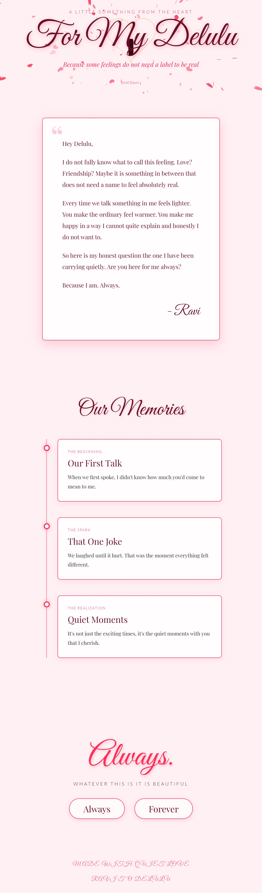

# Delulu - Proposal Card

A romantic 3D web experience built with Next.js and Three.js. The app presents a personalized love letter, animated heart visuals, ambient music, and interactive reply buttons.



## Table of Contents

- [Overview](#overview)
- [Installation](#installation)
- [Running Locally](#running-locally)
- [Build & Production](#build--production)
- [Architecture](#architecture)
- [Editable Content](#editable-content)
- [API Endpoints](#api-endpoints)
- [Features](#features)
- [Tech Stack](#tech-stack)
- [Deployment](#deployment)

## Overview

Delulu is a single-page romantic web app that combines elegant typography, customizable content, Three.js animations, music playback, and interactive memory cards. The website is built using the Next.js `app` router and includes server routes for content delivery and response tracking.

## Installation

1. Install Node.js 18 or later.
2. Open a terminal in the project root.
3. Run:

```bash
npm install
```

## Running Locally

Start the development server:

```bash
npm run dev
```

By default, Next.js uses port `3000`. If that port is busy, the runtime automatically falls back to the next available port (for example, `3001` or `3002`).

Open the app in your browser at:

```text
http://localhost:3000
```

## Build & Production

Build the optimized production version:

```bash
npm run build
```

Run the production server:

```bash
npm run start
```

## Architecture

- `app/layout.js`
  - Root HTML layout and font imports.
- `app/page.js`
  - Main client component.
  - Loads API data and renders the visual page.
  - Manages audio playback, reveal animations, reply events, and content rendering.
- `components/ThreeScene.js`
  - Three.js scene with animated hearts, central rose, star particles, constellation triggers, and click interactions.
- `app/api/letter/route.js`
  - Serves the letter and page copy.
- `app/api/memories/route.js`
  - Serves the timeline memory cards.
- `app/api/reply/route.js`
  - Receives reply button clicks and logs responses.
- `app/api/burst/route.js`
  - Tracks burst events for the particle system.
- `app/siteContent.js`
  - Centralized configuration for editable copy and audio settings.

## Editable Content

The app is designed for easy customization without code changes. All customizable content is centralized in `app/siteContent.js`. Edit this file to update text, phone number, and audio settings.

### Steps to Edit Content:

1. Open `app/siteContent.js` in your code editor.
2. Modify the values in the `siteContent` object as needed.
3. Save the file.
4. Restart the development server (`npm run dev`) or rebuild for production.

### Customizable Fields:

- **Hero Section:**
  - `hero.label`: The small label text above the main heading (e.g., "A little something from the heart").
  - `hero.heading`: The main title (e.g., "For My Delulu").
  - `hero.subtitle`: The subtitle below the heading (e.g., "Because some feelings do not need a label to be real").

- **Letter Section:**
  - `letter.paragraphs`: An array of strings for the letter body. Each string is a paragraph.
  - `letter.signature`: The signature at the end of the letter (e.g., "- Ravi").

- **Always Section:**
  - `always.text`: The main text in the always section (e.g., "Always.").
  - `always.subText`: The smaller text below (e.g., "Whatever this is it is beautiful").

- **Footer:**
  - `footer.textLine1`: First line of footer text (e.g., "Made with quiet love").
  - `footer.textLine2`: Second line of footer text (e.g., "Ravi to Delulu").

- **Contact:**
  - `contact.phoneNumber`: The phone number for WhatsApp replies (e.g., "919488944410"). Include country code without +.

- **Audio:**
  - `audio.songUrl`: Path to the background music file (e.g., "/my_new_song.mp3"). Place audio files in the `public/` folder.

### Example Edits:

To change the letter:

```javascript
letter: {
  paragraphs: [
    "New first paragraph.",
    "New second paragraph.",
    "New third paragraph."
  ],
  signature: "- Your Name"
}
```

To update the phone number:

```javascript
contact: {
  phoneNumber: "1234567890"
}
```

To change the background song:

1. Place your new MP3 file in `public/` (e.g., `public/new_song.mp3`).
2. Update `audio.songUrl` to `"/new_song.mp3"`.

To customize the favicon, replace `public/favicon.svg` with your own SVG icon.

### Notes:

- After editing, refresh the page to see changes.
- Audio files must be MP3 format and placed in `public/`.
- The phone number is used for WhatsApp links when reply buttons are clicked.
- All text supports basic formatting; HTML is not allowed for security.
- **Audio Autoplay:** Browsers may block autoplay without user interaction. The app attempts to play automatically and falls back to starting on the first click, touch, or key press. If audio doesn't start, interact with the page (click anywhere) to enable it.

## API Endpoints

- `GET /api/letter`
  - Returns the page copy and letter payload.
- `GET /api/memories`
  - Returns the list of timeline memory cards.
- `POST /api/reply`
  - Accepts a JSON body like `{ "answer": "Always" }`.
  - Returns `{ success: true, message: "Response recorded!" }` and logs the reply server-side.
- `GET /api/burst`
  - Returns the latest burst timestamp.
- `POST /api/burst`
  - Updates the current burst timestamp for particle triggers.
- `POST /api/update-content`
  - Accepts JSON with updated content fields and saves to `siteContent.json`.
  - Used by the edit modal to update letter text, phone number, and audio URL.

## Features

- Customizable letter content, headers, and footer.
- Background audio playback on page load.
- Animated Three.js heart and rose scene.
- Timeline memory cards with content from the API.
- Reply buttons that open WhatsApp and record responses.
- Secret burst trigger for extra particle effects.
- **Edit Button**: Click the ✏️ button at the top-right to open an edit modal for updating letter text, phone number, and background song URL.
- Audio and copy content centralized for easy updates.

## Tech Stack

- Next.js 14
- React 18
- Three.js 0.160
- Socket.io client dependency included for real-time extension support
- CSS for responsive layout and animation

## Deployment

This app is compatible with any Node.js host that supports Next.js, such as Vercel, Netlify (Next.js build target), or a custom server.

Recommended steps:

1. Ensure Node.js 18+ is used.
2. Install dependencies: `npm install`
3. Build: `npm run build`
4. Start: `npm run start`

If deploying to Vercel, connect the repository and allow Vercel to detect the Next.js framework configuration automatically.

## Notes

- No environment variables are required for the current app configuration.
- The audio asset is currently served from `public/my_new_song.mp3`.
- Content and phone number are centralized in `app/siteContent.js` for quick editing.
